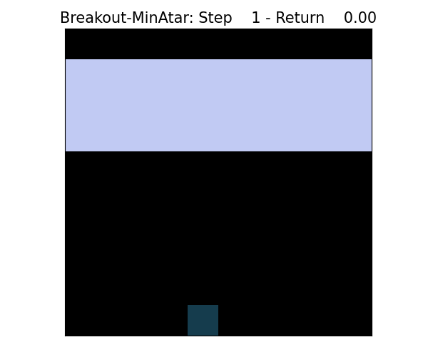

# Learning RL Jax
Repository of deep reinforcement learning (DRL) algorithms, written completely in Jax + Flax NNX for Anakin-style end-to-end GPU-accelerated training. Standardized environment (and WIP algorithm) API provides a clean interface, with wrappers allowing it to be used with popular Jax RL environment libraries, including Gymnax and Jumanji (TODO: Brax). 

Algorithms include: Tabular Q-Learning (w/ optional linear interpolation), Deep Q-Learning (DQN); TODO: Advantage Actor-Critic (A2C), Proximal Policy Optimization (PPO), Soft Actor-Critic (SAC). 

Custom environments include: Gridworld, Flappy Bird, Soccer2D, BlockTanks.